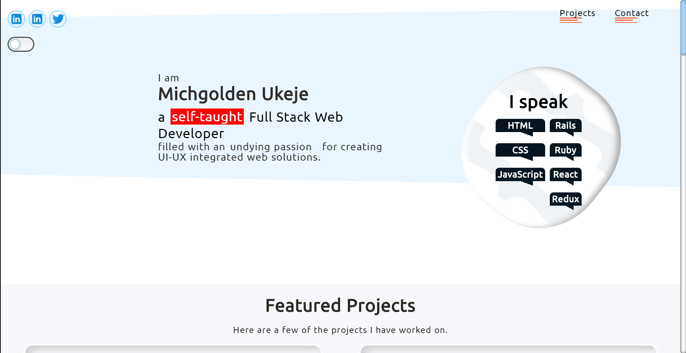

[![Issues][issues-shield]][issues-url]
[![MIT License][license-shield]][license-url]

# Portfolio
Portfolio Page

 This is a portfolio showcase of my recent projects. [Front-End-Design]

 

  

  <h3 align="center">
  Portfolio Page
  </h3>

  <h3 align="center">
	 Live Version - https://michgolden.netlify.app/
  </h3>

  

    This project is meant to showcase a few of my projects, which I have all joyously worked on within a given timeframe.
     
    <a href="https://github.com/mikenath223/Portfolio/blob/master/README.md"><strong>Explore the docs 📚</strong></a>
     
    🐱‍🚀
    <a href="https://github.com/mikenath223/Portfolio/issues">Report Bug</a>
    🙏
    <a href="https://github.com/mikenath223/Portfolio/issues">Request Feature</a>
  

# Screenshot

# Get Started
- Clone the repo to your local machine.
- Open the `index.html` file on your browser and use.

# Built With
  - Passion for coding 💜
  - `HTML`
  - `CSS`
  - `JavaScript`

# Author
Ukeje Michgolden :man: 

* [Github profile](https://github.com/mikenath223)
* [LinkedIn](https://www.linkedin.com/in/michgoldenukeje/)
* [Twitter](https://twitter.com/MichgoldenU)

# License

This project is licensed under the MIT License - see the [LICENSE](https://github.com/mikenath223/Portfolio/blob/master/LICENSE) file for details.

<!-- ACKNOWLEDGEMENTS -->
## Acknowledgements
* [Microverse](https://www.microverse.org/)
* [The Odin Project](https://www.theodinproject.com/)

<!-- MARKDOWN LINKS & IMAGES -->
<!-- https://www.markdownguide.org/basic-syntax/#reference-style-links -->
[issues-shield]: https://img.shields.io/github/issues/mikenath223/Portfolio
[issues-url]: https://github.com/mikenath223/Portfolio/issues
[license-shield]: https://img.shields.io/github/license/mikenath223/Portfolio
[license-url]: https://github.com/mikenath223/Portfolio/blob/master/LICENSE.txt
